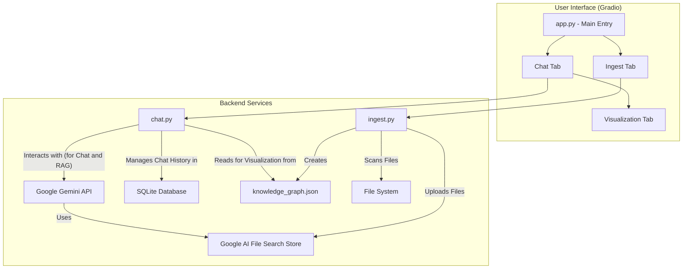

This diagram illustrates the architecture of the Aurora Codex application.

*   The **User Interface** is built with Gradio and is divided into several tabs.
*   `app.py` is the main entry point that launches the UI.
*   The **Ingest Tab** uses `ingest.py` to:
    *   Scan the local **File System**.
    *   Upload files to the **Google AI File Search Store**.
    *   Create the **knowledge_graph.json** by analyzing Python files.
*   The **Chat Tab** is powered by `chat.py`, which:
    *   Communicates with the **Google Gemini API** to get chat responses, using the **File Search Store** for Retrieval-Augmented Generation (RAG).
    *   Manages the conversation history in a **SQLite Database**.
    *   Reads the **knowledge_graph.json** to generate visualizations.
*   The **Visualization Tab** displays the diagrams created by `chat.py`.
